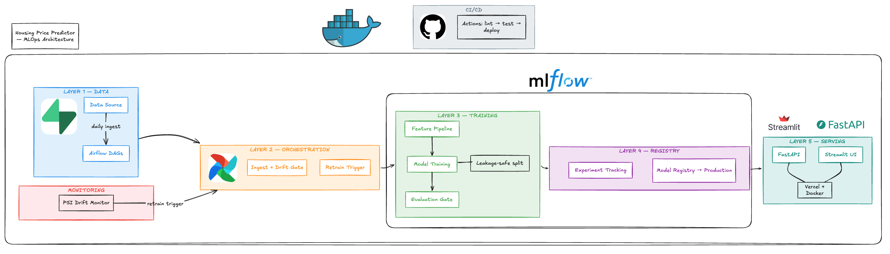
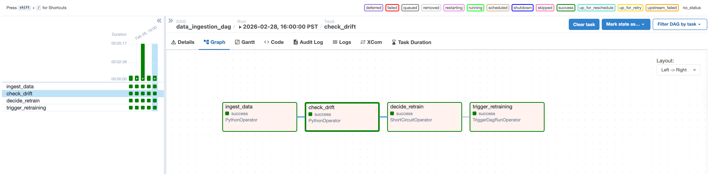
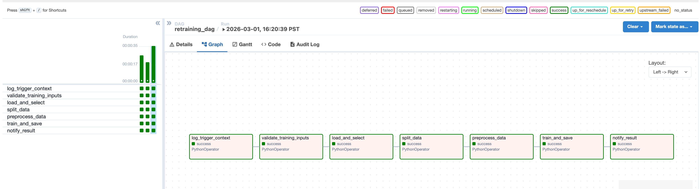

[](https://github.com/HaDo1802/housing_price_predictor/actions/workflows/ml_pipeline_ci.yml)

# Housing Price Predictor: End-to-End MLOps Project




- Live Space: https://housing-predictor-ui.onrender.com/
- **Deployed API:** [https://realestatepredictor-81yl5mgxf-hado1802s-projects.vercel.app/](https://realestatepredictor-81yl5mgxf-hado1802s-projects.vercel.app/)  
  *(Note: Please allow 10–15 seconds for the server to start up)*

Transforming the classic **beginner house price prediction** problem into a **production-grade machine learning project** that implements practical MLOps patterns across the entire lifecycle:
- config-oriented management using config.ymal 
- modular data + feature pipelines
- reproducible training and evaluation
- experiment tracking and model governance with MLflow
- conditional promotion to production
- FastAPI/UI serving 
- drift checks (PSI-based)
- CI quality gates

## Airflow Orchestration

The project now includes two Airflow DAGs to automate training operations:

- `data_ingestion_dag`: runs daily ingestion, then drift gate logic, then triggers retraining.
- `retraining_dag`: runs retraining steps and writes training artifacts.

### DAG: Data Ingestion + Drift Gate



### DAG: Retraining Pipeline



Current operating mode:

- We are intentionally retraining daily for now to populate training history quickly.
- This is acceptable because current training time is fast, and I did not registry training model automatically .
- PSI drift detection logic is already implemented and can be used as the strict gate once dataset volume grows.


## Project Goals

This repository is designed as a learning + portfolio project to show how an ML model can move from notebook experimentation into a maintainable production workflow.

Core goals:

- Build a reliable training pipeline with leakage-safe preprocessing.
- Track runs, metrics, and lineage with MLflow.
- Promote models using explicit quality gates instead of manual intuition.
- Serve predictions through a stable API and web UI.
- Keep deployment paths flexible for local, containerized, and serverless runtime.
- Add monitoring hooks for post-deployment feedback and drift detection.

## Why This Architecture

The codebase is intentionally separated by responsibility:

- `src/housing_predictor/`: core ML package logic (reusable + testable).
- `pipelines/`: operational entrypoints for jobs (train, tune, promote, monitor).
- `serving/`: online inference layer (FastAPI + Streamlit + Vercel entrypoint).
- `conf/`: configuration as code with base + environment overrides.
- `tests/`: unit + integration tests to protect behavior.

This structure scales better than notebook-centric projects because each concern evolves independently:

- model logic changes do not require API rewrites
- deployment/runtime changes do not require training rewrites
- config changes do not require code edits

## MLOps Practices Implemented

### 1) Configuration Layering and Environment Overrides

Implemented in [config_manager.py](src/housing_predictor/config_manager.py) with layered config loading:

- base config from `conf/base/*.yaml`
- environment override from `conf/local/` or `conf/production/`
- final override from `conf/config.yaml`

Why this pattern matters:

- lets one codebase run in local, CI, and production contexts
- avoids hard-coding paths/hyperparameters
- improves reproducibility and auditability

### 2) Leakage-Safe Data and Feature Pipeline

Implemented across:

- [splitter.py](src/housing_predictor/data/splitter.py)
- [preprocessor.py](src/housing_predictor/features/preprocessor.py)
- [training.py](src/housing_predictor/pipelines/training.py)

Key practice:

- split first
- fit preprocessing only on training data
- transform val/test/production with the fitted transformer

Why this pattern matters:

- prevents target/data leakage
- keeps offline evaluation closer to production reality
- ensures consistent feature transformations online/offline

### 3) Reproducible Model Factory + Validation

Implemented in [trainer.py](src/housing_predictor/models/trainer.py):

- model type registry (`random_forest`, `ridge`, `gradient_boosting`, `hist_gradient_boosting`), as user can choose mulitple models for testing purpose
- hyperparameter validation against sklearn constructor signatures
- optional `TransformedTargetRegressor` (`log1p`/`expm1`) for stable target modeling

Why this pattern matters:

- limits configuration mistakes
- standardizes model creation
- makes experiments comparable
- serve as a centralized remote that control all the variable/config for the project

### 4) Experiment Tracking and Registry Governance

Implemented in:

- [training.py](src/housing_predictor/pipelines/training.py)
- [registry.py](src/housing_predictor/models/registry.py)

Tracked in MLflow:

- parameters, metrics, tags, model artifact, feature metadata, config snapshots
- model version tags including git commit and model type

Why this pattern matters:

- you can answer "what model is in production and where did it come from?"
- supports rollback/debugging and lineage traceability

### 5) Metric Gate Before Promotion

Implemented in [check_metric.py](src/housing_predictor/models/check_metric.py):

- compare candidate metric vs current production metric
- promote only if threshold is exceeded

Default behavior:

- if no production model exists: accept candidate
- else require improvement (default threshold `0.02` on `test_r2`)

Why this pattern matters:

- prevents accidental regressions from being promoted
- turns model promotion into a policy, not an ad-hoc decision

### 6) Artifact Strategy for Serving Reliability

Implemented in [promote.py](src/housing_predictor/models/promote.py) and [inference.py](src/housing_predictor/pipelines/inference.py):

- save local production artifacts (`model.pkl`, `preprocessor.pkl`, `metadata.json`, `config.yaml`)
- online inference tries MLflow registry first
- fallback to local production artifacts when MLflow is unavailable

Why this pattern matters:

- supports multiple runtime environments (cloud/serverless/local)
- improves resilience during external dependency outages

### 7) Online Serving Interface

Implemented in:

- [main.py](serving/api/main.py)
- [predict.py](serving/api/routers/predict.py)
- [model.py](serving/api/routers/model.py)
- [health.py](serving/api/routers/health.py)
- [streamlit_app.py](serving/app/streamlit_app.py)

Serving capabilities:

- single prediction
- batch prediction
- file upload prediction (`.csv`/Excel)
- health endpoint
- model info endpoint
- confidence interval output (when estimator supports ensembles)

Why this pattern matters:

- clean separation between model internals and consumer-facing interfaces
- easier integration with product frontends and external services

### 8) Post-Deployment Drift Monitoring

Implemented in:

- [drift.py](src/housing_predictor/monitoring/drift.py)

Current monitoring includes:

- PSI drift checks against a reference snapshot

Why this pattern matters:

- shifts project from pure training to lifecycle monitoring
- creates a path toward retraining triggers and model observability

### 9) CI Quality Gates

Implemented in [ml_pipeline_ci.yml](.github/workflows/ml_pipeline_ci.yml):

- formatting check (`black --check`)
- linting (`flake8`)
- tests (`pytest`)

Why this pattern matters:

- enforces consistent standards before merge
- catches integration errors early (e.g., missing tracked modules/imports)

## End-to-End Workflow

```text
Raw data
  -> feature selection from config
  -> train/val/test split
  -> fit preprocessor on train only
  -> train model
  -> evaluate on val/test
  -> log run + artifacts to MLflow
  -> gate candidate vs Production metric
  -> register/promote (if pass)
  -> sync production artifacts locally
  -> serve via API/UI
  -> monitor drift
```

## Repository Structure

```text
.
├── api/                         # Vercel-compatible entrypoint
├── conf/                        # Layered configuration (base/local/production)
├── data/                        # Raw, processed, sample, and feedback datasets
├── docker/                      # Dockerfiles + compose setup
├── image/                       # Cover image and media assets
├── notebooks/                   # Exploration and experimentation notebooks
├── pipelines/                   # CLI/job scripts (train, tune, promote, monitor)
├── serving/                     # FastAPI service + Streamlit app + Vercel app
├── src/housing_predictor/       # Core ML package
│   ├── data/
│   ├── features/
│   ├── models/
│   ├── monitoring/
│   └── pipelines/
├── tests/                       # Unit + integration tests
├── Makefile
├── pyproject.toml
├── requirements.txt
└── README.md
```

## Quick Start

### 1) Install Dependencies

```bash
python -m pip install --upgrade pip
python -m pip install -r requirements.txt
python -m pip install -e .
```

### 2) Run Quality Checks

```bash
make format
make lint
make test
```

### 3) Train Model Pipeline

```bash
python pipelines/run_training.py
```

### 4) Inspect MLflow

```bash
mlflow ui
```

Open `http://localhost:5000`.

### 5) Serve FastAPI

```bash
make api
```

### 6) Run Streamlit UI

```bash
make ui
```

## Pipeline Scripts

- Train pipeline:

```bash
python pipelines/run_training.py
```

- Hyperparameter search:

```bash
python pipelines/run_tuning.py
```

- Promote model / sync production artifacts:

```bash
python pipelines/run_promote.py --list-only
python pipelines/run_promote.py --model-name housing_price_predictor --version 3 --stage Production
```

- Drift check utility:

```bash
python src/housing_predictor/monitoring/drift.py
```

## API Endpoints

Base URL local: `http://localhost:8000`

- `GET /health`
- `GET /model/info`
- `POST /predict`
- `POST /predict/batch`
- `POST /predict/file`

Swagger docs: `http://localhost:8000/docs`

## Docker Deployment

```bash
docker compose -f docker/docker-compose.yml up --build
```

Services:

- FastAPI on `8000`
- Streamlit on `8501`

`models/production` is mounted read-only into containers to keep serving artifacts explicit and immutable at runtime.

## Testing Strategy

Tests currently include:

- integration import checks for training/inference pipelines
- unit tests for data split logic
- unit tests for preprocessor fit/transform behavior
- unit tests for regression metric outputs
- unit tests for drift/monitoring utilities

Run:

```bash
python -m pytest tests -v
```

## Scaling and Future Evolution

The current design already supports several scaling directions:

- More models:
  Add new estimators in the trainer registry without changing serving contract.
- More environments:
  Use config layering to separate local/CI/prod data paths and settings.
- Stronger governance:
  Extend promotion gates with multiple metrics and safety checks.
- Better observability:
  Push feedback/drift metrics to a dashboard or alerting stack.
- Safer deployments:
  Add canary/staging traffic split using model stage transitions.

## Learning Outcomes Demonstrated

This project demonstrates practical skills in:

- ML system design and modular architecture
- reproducible training pipelines
- experiment tracking and model registry workflows
- model promotion governance using metric thresholds
- production API and UI integration
- monitoring-aware ML lifecycle design
- CI/CD quality automation
- containerized deployment patterns

## Author

Ha Do
- Email: havando1802@gmail.com
